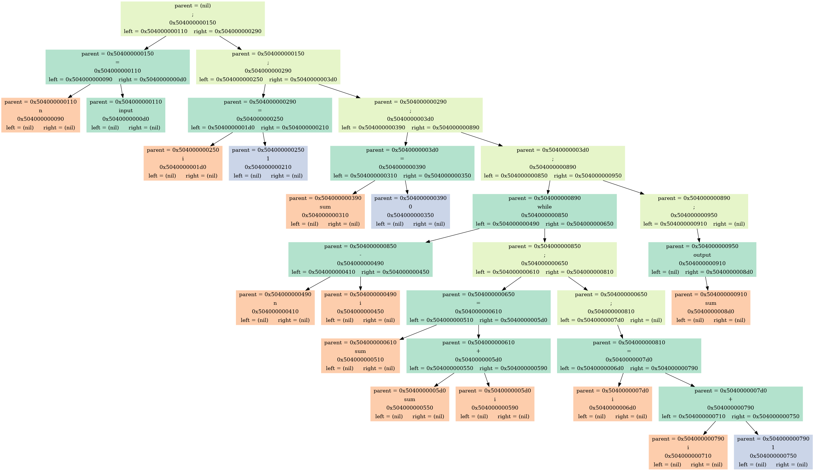

# Язык программирования

## Цель работы
Цель проекта заключалась в реализации компилятора собственного языка программирования, генерирующего ассемблерный код для написанного ранее SPU, реализация которого находится в отдельном репозитории(https://github.com/S4ms483/SPU).

## Реализация

### Front-end

Код, написанный в соответствии с определенной грамматикой ([см. ниже](###Грамматика)) считывается из текстового файла в буфер. 

Полученный текст делится на ``токены`` - элементы одного из трех возможных типов (``число, переменная, ключевое слово``). Ключевыми словами также могут быть значимые для синтаксиса символы, такие как скобки, точка с запятой или знаки арифметических операций.

С помощью метода рекурсивного спуска по массиву токенов строится бинарное абстрактное синтаксическое дерево (``AST``). Одна нода содержит адреса "родителя", левого и правого "детей", тип данных и значение. 

### Back-end

Программа считывает из текстового файла дерево, записанное туда на этапе Front-end'а.

При рекурсивном обходе полученного дерева в текстовый файл записывается ассемблерный код, аналогичный написанному изначально. Метки обозначены числами, есть таблица имен для проверки на работу с неинициализированными переменными.


### Грамматика

Для успешного построения AST код должен быть написан согласно приведенной ниже грамматике:

```bnf
<body> ::= {<statement> ";"}+

<statement> ::= [<if> | <while> | <input> | <output> |  <assignment> | <expression>] ";"

<if> ::= "if" "(" <expression> ")" "(" <body> ")"
<while> ::= "while" "(" <expression> ")" "(" <body> ")"

<input> ::= <variable> "=" "input"
<output> ::= "output" "(" <variable> ")"

<assignment> ::= <variable> "=" <expression>
<expression> ::= <term> (("+" | "-") <term>)*
<term> ::= <parenth> (("*" | "/") <parenth>)*
<parenth> ::= "(" <expr> ")" | <number> | <variable>

<variable> ::= [a-z A-Z] {a-z A-Z 0-9 _}*
<number> ::= {0-9}+

```

### Dump 

Для отладки можно вызвать отрисовку дерева синтаксиса с помощью функции
``` C
void VisualDump(Node* root, int n_dump);
```
В ней ``root`` - это корень этого бинарного дерева.
а ``n_dump`` - номер вызова функции для отрисовки нескольких этапов создания дерева

Пример построенного дерева:


